[Link to page](https://emcion.github.io/Spooky-Stories-P1/)
# Spooky-Stories-P1

## Table of Contents
[UX](#ux)
  * [Goal for the Project](#goal-for-the-project)
  * [User Goals](#user-goals)
  * [User Stories](#user-stories)
  * [Site owner Goals](#site-owner-goals)
  * [Design Choices](#design-choices)
    * [Font](#font)
    * [Icons](#icons)
    * [Colours](#colours)
    * [Structure](#structure)
  * [Features](#features)    
  * [Future Plans](#future-plans)      
  * [Tehnologies used](#tehnologies-used)
    * [Languages](#languages)
    * [Tools](#tools)
  * [Testing](#testing)
  * [Deployment](#deployment)
  * [Credits](#credits)
## UX
## Goal for the Project
The goal of the project is to create a simple, well-structured website that presents scary stories to visitors in an engaging way. The website will feature three scary stories and include a newsletter signup to allow users to receive updates or future stories.
### User Goals
* Read and enjoy scary stories.
* Easily navigate between the different stories.
* Subscribe to a newsletter to receive more scary stories or updates.
* Experience an immersive atmosphere that matches the horror theme.
### User Stories
* As a visitor, I want to read scary stories so that I can enjoy horror content.
* As a visitor, I want the website to be easy to navigate so that I can find the stories quickly.
* As a visitor, I want to subscribe to a newsletter so that I can receive new scary stories via email.
* As a visitor, I want the website design to reflect the scary theme to enhance my reading experience.
### Site owner Goals
* Create a functional and visually appealing website using HTML and CSS.
* Practice and demonstrate web development skills.
* Build a simple user interface that offers engaging content.
* Attract users to read the stories and subscribe to the newsletter.
### Design Choices
#### Font
* Used Roboto from Google Fonts for clean readability with a slight modern touch, contrasting the eerie visuals.
#### Icons
* Integrated Font Awesome icons for social media links and the hamburger menu to enhance visual communication.
#### Colours
* Dark tones (black, dark brown) combined with desaturated backgrounds to reinforce a gothic, spooky aesthetic.
* Accent color #ff4444 (bright red) on hovers and headings to suggest blood and danger.

#### Structure
* Wireframes

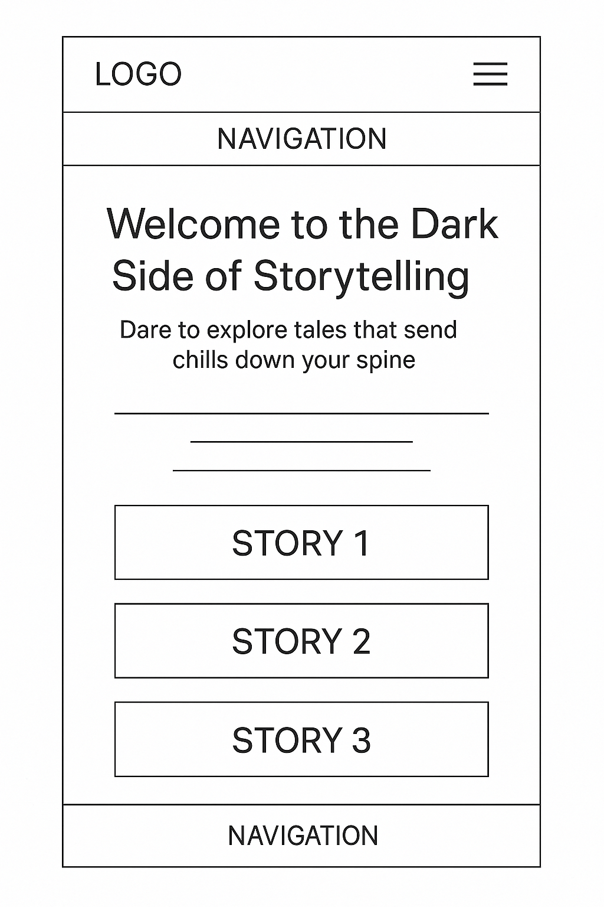
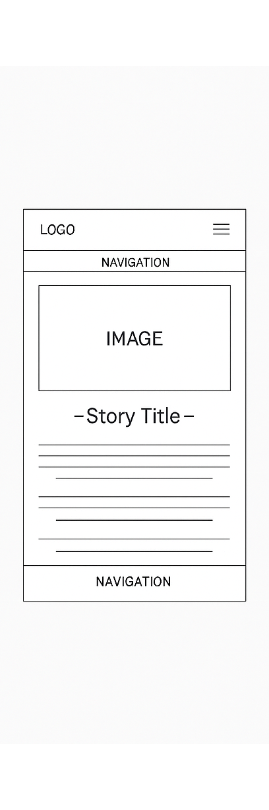
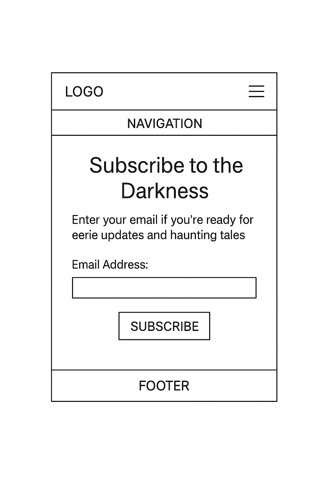

* Sticky navigation bar for easy access.

* Three story sections, each visually separated by “bat bar” dividers.

* A call-to-action newsletter section.

* Footer with social media links for broader reach.

### Features
* Responsive Navbar: A top navigation bar with links to each story and the newsletter. Collapses into a mobile-friendly menu on small screens.

* Hero Section: Large background image with an introduction inviting users into the world of horror stories.

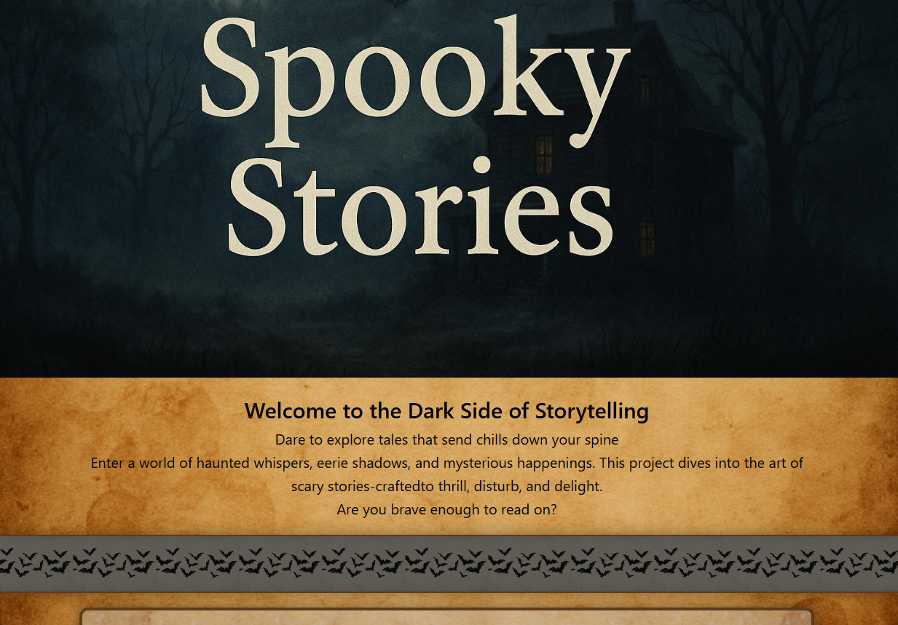

* Three Illustrated Stories: Each story has an associated image, styled like aged paper to deepen the theme.

Story one

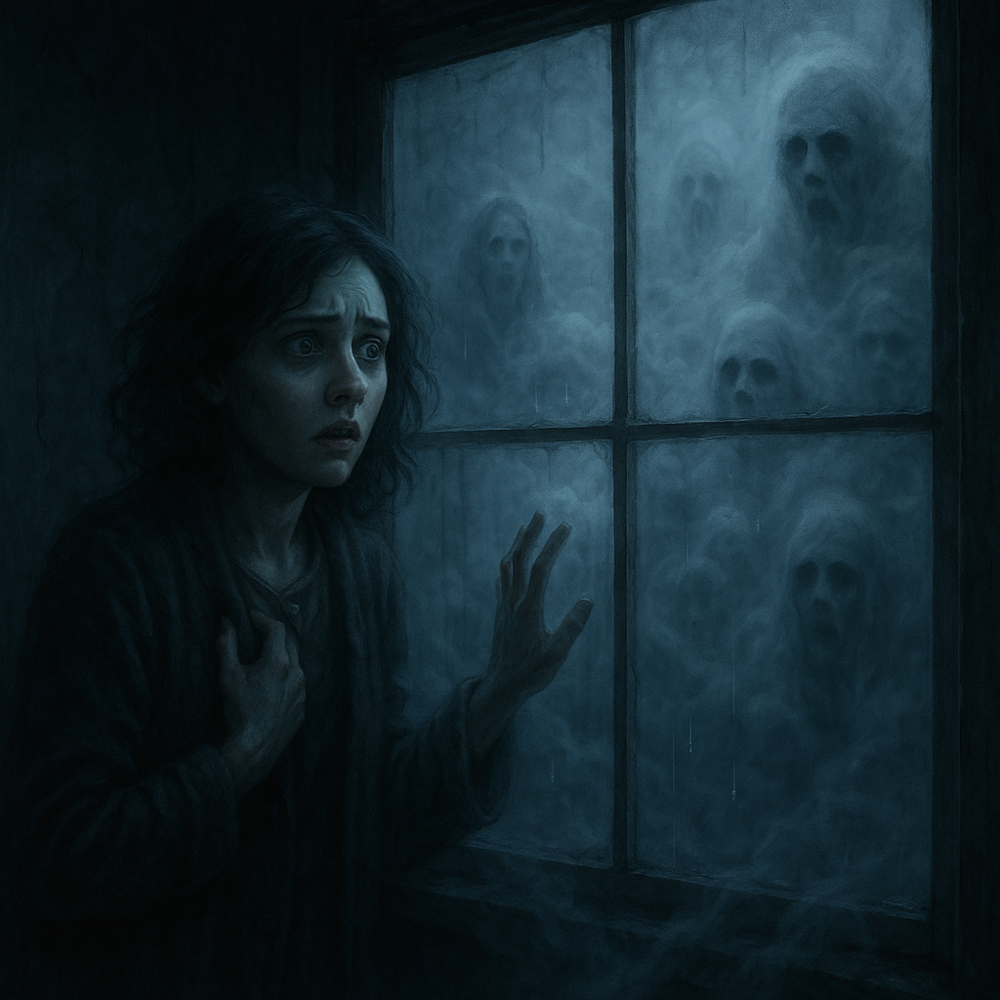

Story two

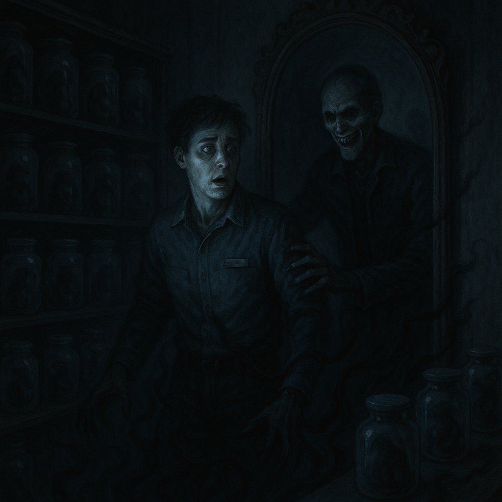

Story three

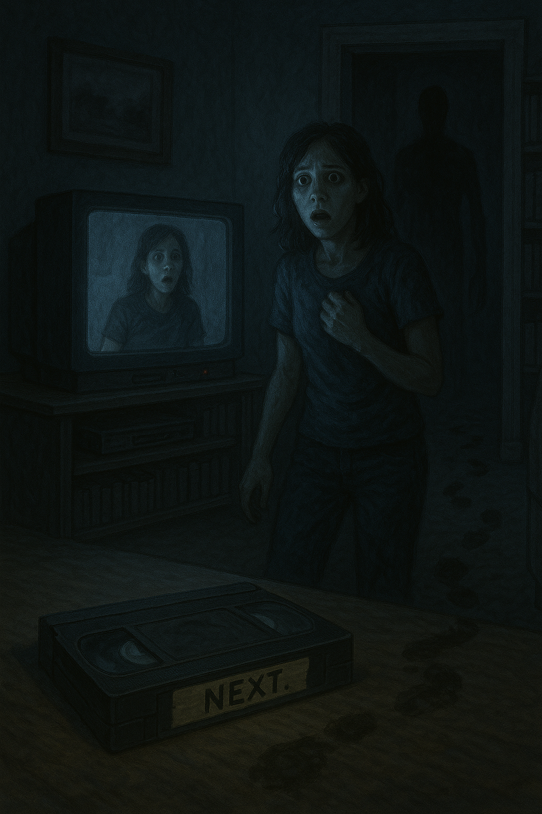

* Newsletter Section: Prompts users to subscribe for more stories.

* Thank you page to confirm you subsription.

### Future Plans
* Add more stories.

* Introduce short audio clips or ambient background sounds for each story.

### Tehnologies used
#### Languages
* [HTML](https://en.wikipedia.org/wiki/HTML5)
* [CSS](https://en.wikipedia.org/wiki/CSS)
#### Frameworks and Libraries
* [Font Awesome](https://fontawesome.com) - Used for icons on the website.
* [Google fonts](https://fonts.google.com) - Used for text font on page.
* [balsamiq](https://balsamiq.com/) Balsamiq used to create wireframes
#### Tools
* [Gitpod](https://gitpod.io/workspaces) - Used for building the website.
* [Github](https://github.com/) - Used to deploy the project.
* [Vs code](https://code.visualstudio.com/) - Used for building the website. 
* [W3C HTML Validation Service](https://validator.w3.org/) - Used to test HTML.
* [W3C CSS Validation Service](https://jigsaw.w3.org/css-validator/) - Used to test CSS.
* [Devtools](https://developer.chrome.com/docs/devtools/#:~:text=Chrome%20DevTools%20is%20a%20set,you%20can%20open%20Chrome%20DevTools.) - I checked all the time how my code works and if there are any errors in console
### Testing
* Hmtl validation
  - index.html

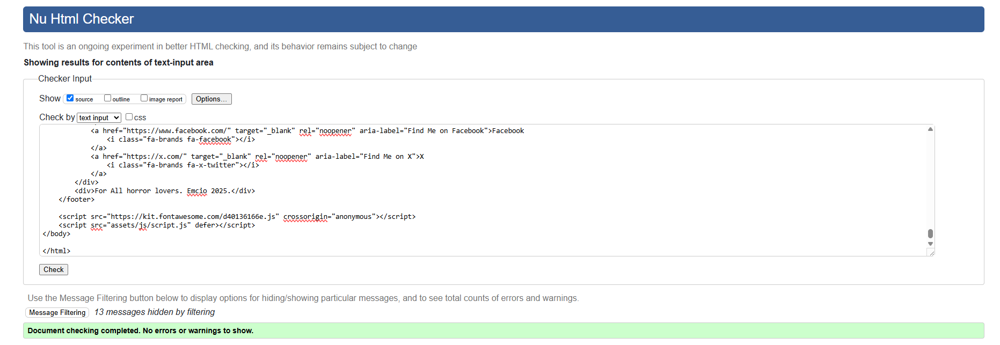

  - newsletter.html

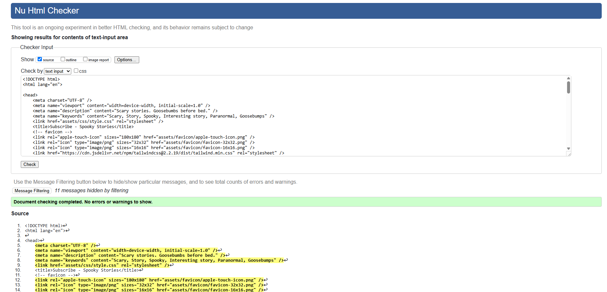

* CSS validation

* Manually tested navigation links to ensure they jump to the correct sections.

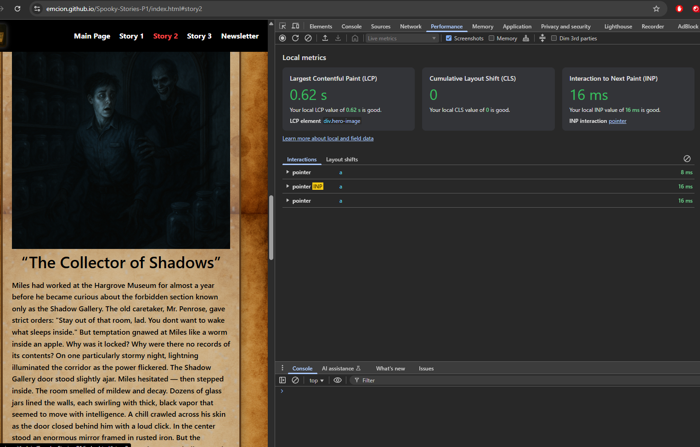

* Verified responsiveness on devices by resizing the browser and using Chrome DevTools.

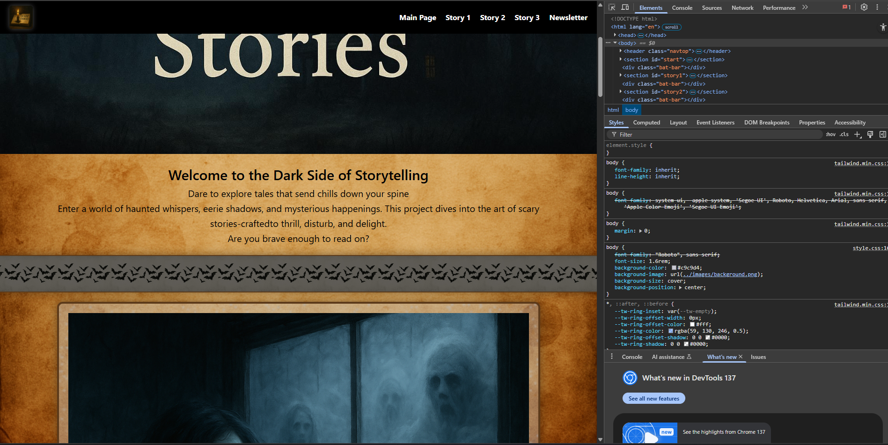

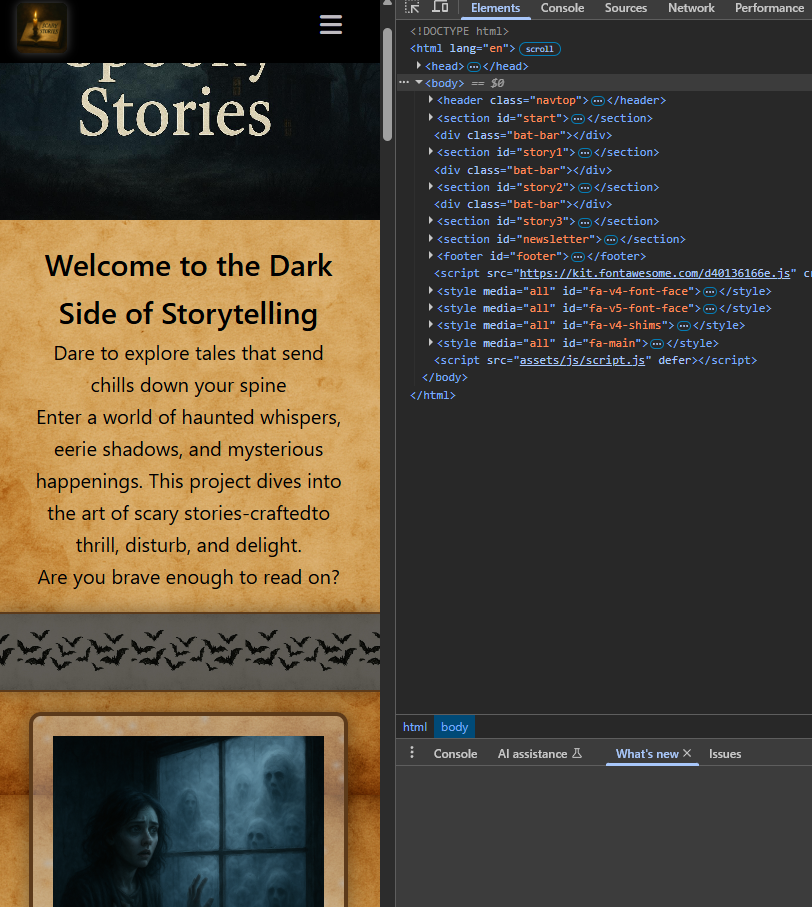

* Checked hover effects on navigation and buttons for consistency.

* Ensured newsletter link routes to the newsletter.html page.

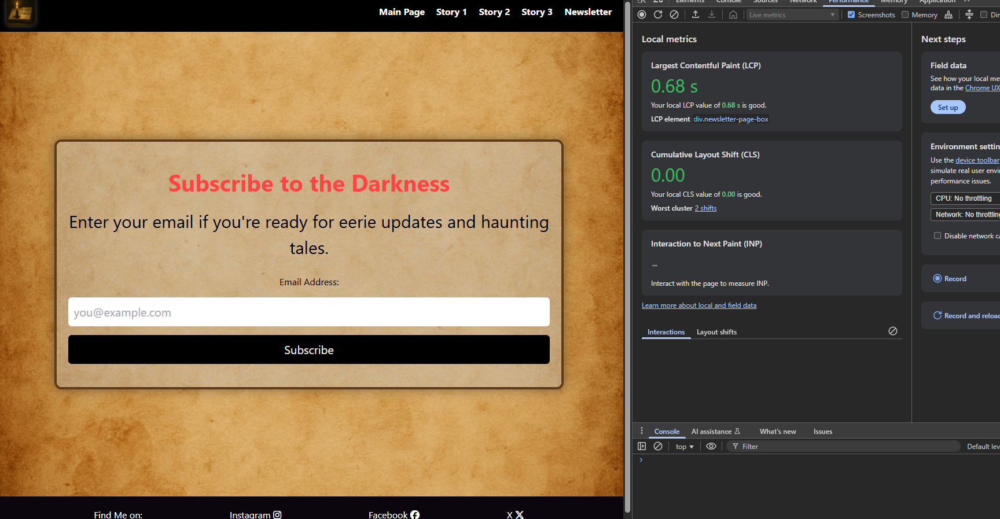

* Confirmed that the mobile menu shows/hides appropriately.

* Ensured form is working as intended 

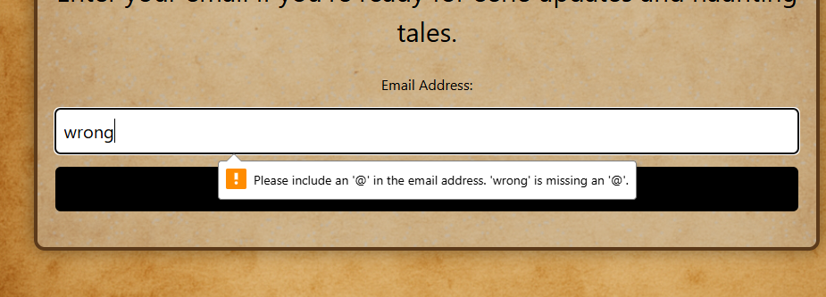

### Deployment
* Go to the Settings tab of your GitHub repo.

* On the left-hand sidebar, in the Code and automation section, select Pages.

* Make sure:

  - Source is set to 'Deploy from Branch'.

  - Main branch is selected.

  - Folder is set to / (root).
* Under Branch, click Save.

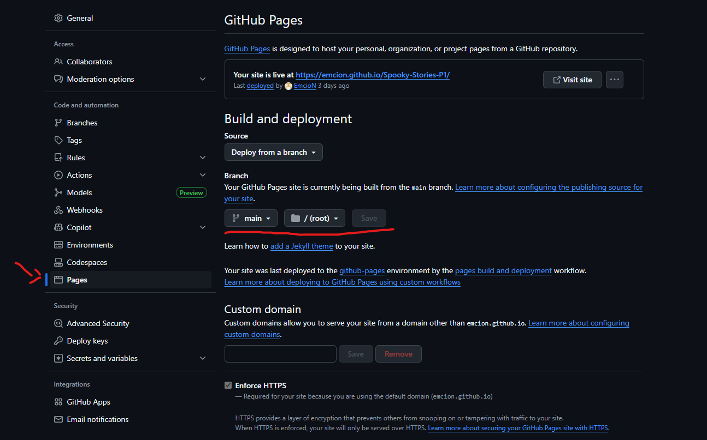

* Go back to the Code tab. Wait a few minutes for the build to finish and refresh your repo.
* On the right-hand side, in the Environments section, click on 'github-pages'.

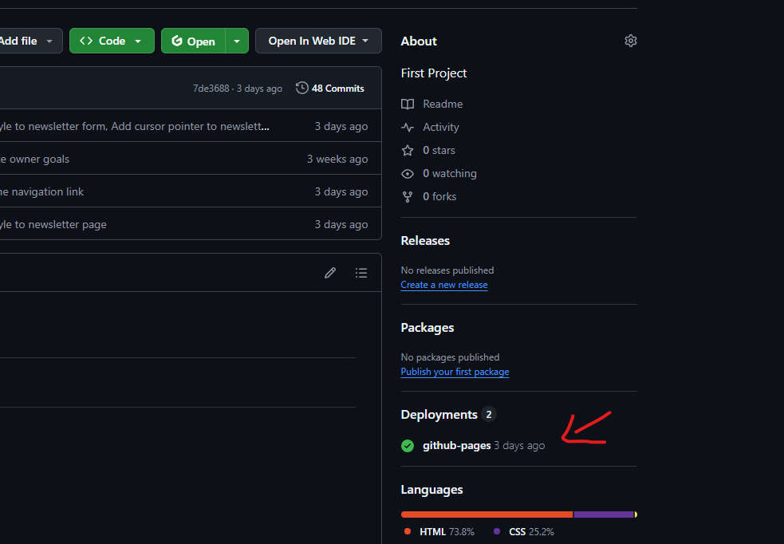

* Click View deployment to see the live site. The URL will look similar to [Link to page](https://emcion.github.io/Spooky-Stories-P1/)

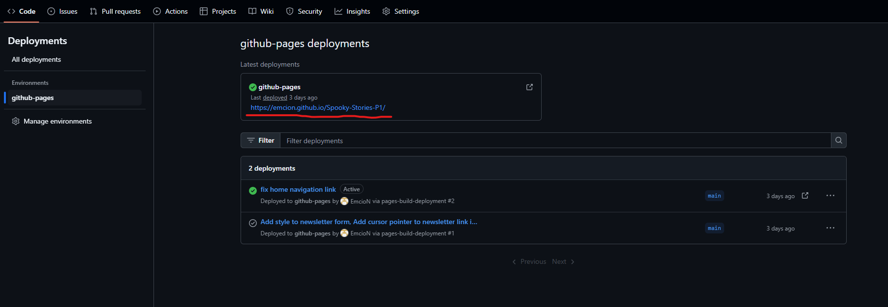
### Credits
* I was helping myself with resources gathered during building my different projects.

* Stories: Stories are generated.

* Images: Free images generated for project needs.

* Icons: Font Awesome

* Fonts: Roboto from Google Fonts.

