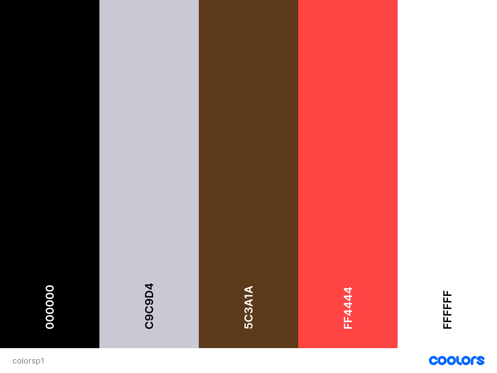
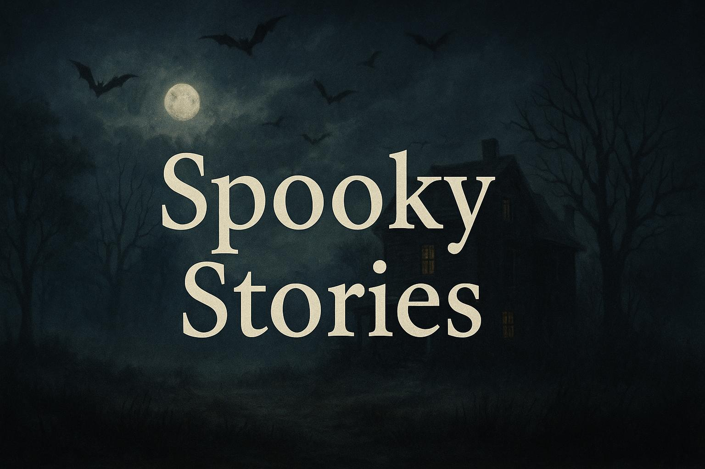
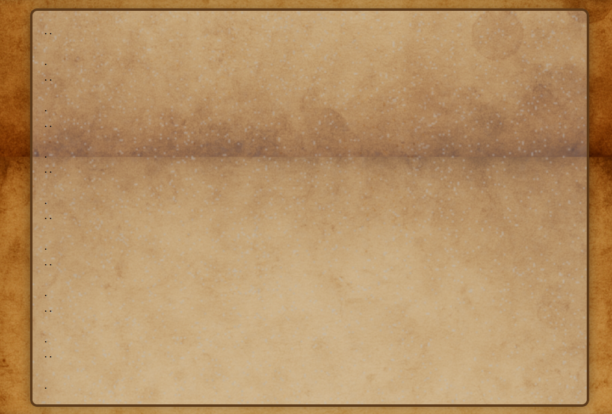
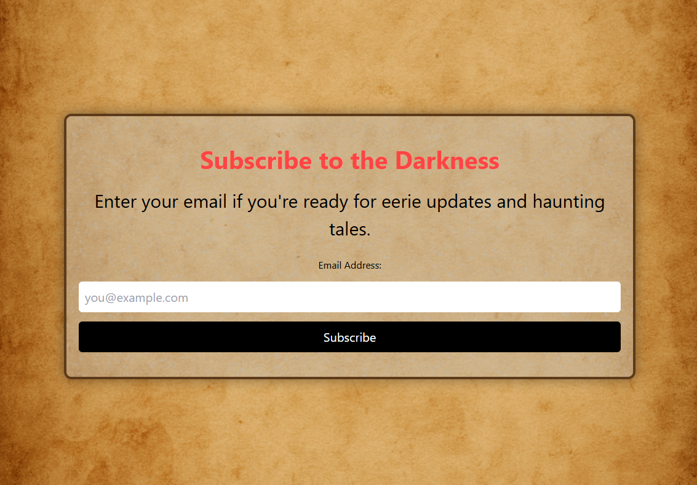

# Spooky-Stories-P1

## Table of Contents
[UX](#ux)
  * [Goal for the Project](#goal-for-the-project)
  * [User Goals](#user-goals)
  * [User Stories](#user-stories)
  * [Site owner Goals](#site-owner-goals)
  * [Design Choices](#design-choices)
    * [Font](#font)
    * [Icons](#icons)
    * [Colours](#colours)
    * [Structure](#structure)
  * [Features](#features)    
  * [Future Plans](#future-plans)      
  * [Tehnologies used](#tehnologies-used)
    * [Languages](#languages)
    * [Tools](#tools)
  * [Testing](#testing)
  * [Deployment](#deployment)
  * [Credits](#credits)
## UX
## Goal for the Project
The goal of the project is to create a simple, well-structured website that presents scary stories to visitors in an engaging way. The website will feature three scary stories and include a newsletter signup to allow users to receive updates or future stories.
### User Goals
* Read and enjoy scary stories.
* Easily navigate between the different stories.
* Subscribe to a newsletter to receive more scary stories or updates.
* Experience an immersive atmosphere that matches the horror theme.
### User Stories
* As a visitor, I want to read scary stories so that I can enjoy horror content.
* As a visitor, I want the website to be easy to navigate so that I can find the stories quickly.
* As a visitor, I want to subscribe to a newsletter so that I can receive new scary stories via email.
* As a visitor, I want the website design to reflect the scary theme to enhance my reading experience.
### Site owner Goals
* Create a functional and visually appealing website using HTML and CSS.
* Practice and demonstrate web development skills.
* Build a simple user interface that offers engaging content.
* Attract users to read the stories and subscribe to the newsletter.
### Design Choices
#### Font
* Used Roboto from Google Fonts for clean readability with a slight modern touch, contrasting the eerie visuals.
#### Icons
* Integrated Font Awesome icons for social media links and the hamburger menu to enhance visual communication.
#### Colours
* Dark tones (black, dark brown) combined with desaturated backgrounds to reinforce a gothic, spooky aesthetic.
* Accent color #ff4444 (bright red) on hovers and headings to suggest blood and danger.

#### Structure
* Sticky navigation bar for easy access.

* Three story sections, each visually separated by “bat bar” dividers.

* A call-to-action newsletter section.

* Footer with social media links for broader reach.

### Features
* Responsive Navbar: A top navigation bar with links to each story and the newsletter. Collapses into a mobile-friendly menu on small screens.

* Hero Section: Large background image with an introduction inviting users into the world of horror stories.

* Three Illustrated Stories: Each story has an associated image, styled like aged paper to deepen the theme.

Story one

Story two

Story three

* Newsletter Section: Prompts users to subscribe for more stories.

### Future Plans
### Tehnologies used
#### Languages
#### Tools
### Testing
### Deployment
### Credits